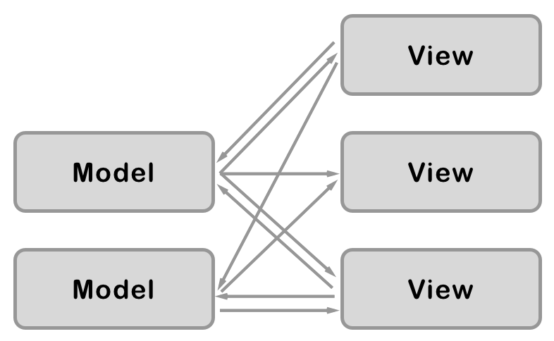
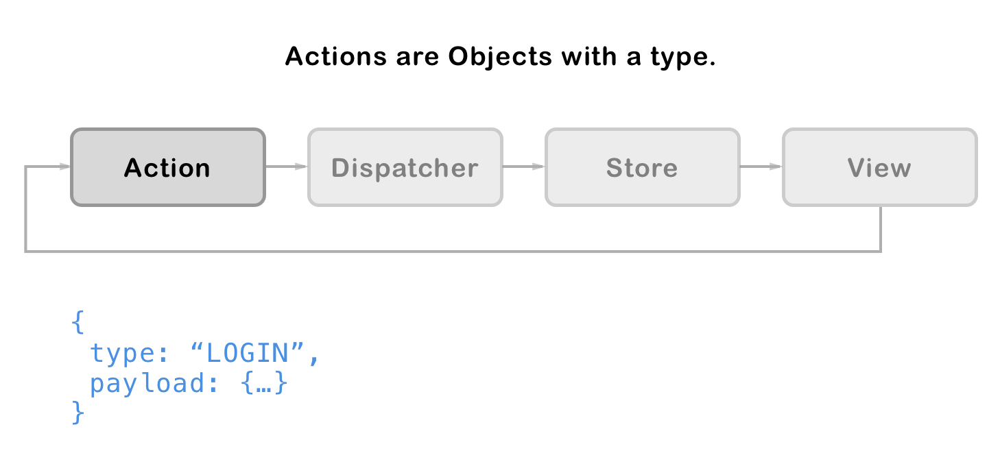
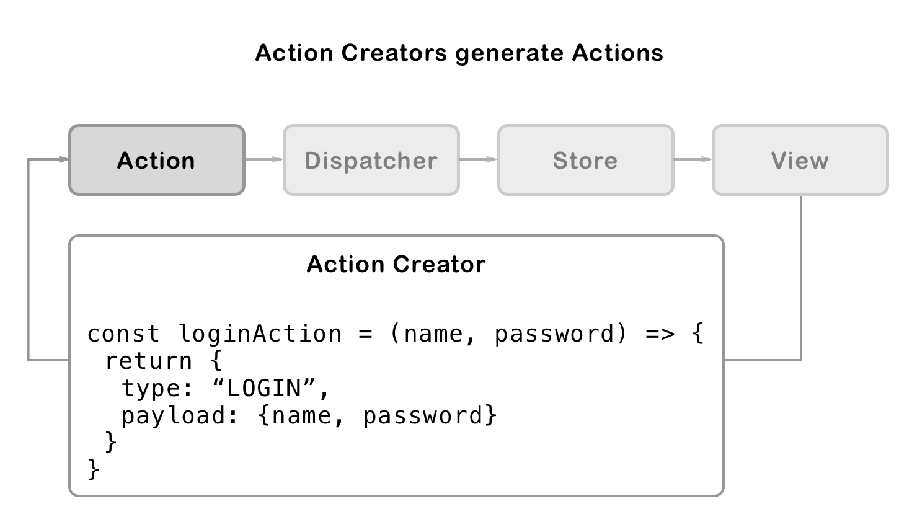
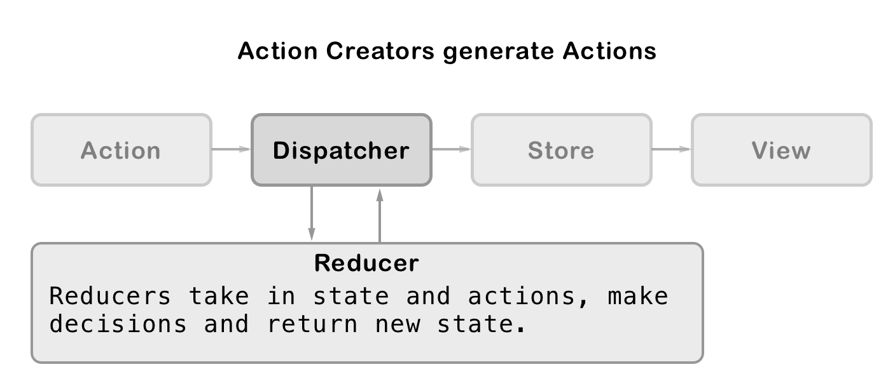
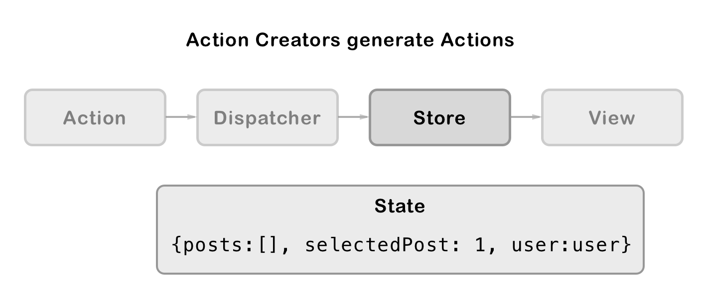

<!-- .slide: data-background="./Images/header.svg" data-background-repeat="none" data-background-size="40% 40%" data-background-position="center 10%" class="header" -->

# FEW 2.3 - Lesson 8

<!-- ➡️ [**Slides**](/Syllabus-Template/Slides/Lesson1.html ':ignore') -->

## Application State

<!-- > -->

Redux is a tool for managing the application state. If you've ever had trouble managing data, changes to data, or handling user input Redux might solve your problems! 

<!-- > -->

Redux is a JS implementation of the Flux pattern which was developed at Facebook for solving problems they were having managing data on the Facebook website. 

<!-- > -->

## Learning Objectives/Competencies

1. Identify Application State 
1. Define Actions and Action Creators 
1. Define Reducers
1. Implement Redux  and React Redux

<!-- > -->

## Slides 

https://docs.google.com/presentation/d/18rfjoYo-Ei2M9teGn0h-PctydE4m9gOlteT99C7R_TI/edit?usp=sharing

<!-- > -->

## What is Application state?

<!-- > -->

Application state is the contents of memory used by your application. You can think about this as all the variables that define your application at any moment. 

<!-- > -->

That might seem like a lot to keep track of. For practical purposes, we don't have to think of the entire contents of memory. Instead, we need to think of only the variables that determine how your application displays itself at the moment. For this purpose, you can remove all of the boilerplate and framework code from the equation. 

**Think of application state as the values that you would have to load to recreate the application in its current "state".**

<!-- > -->

## Discuss Application State

Discussion: Identify the state in your application. Think of one of your applications and identify all of the variables that would be required to reload the application into a previous state.

Identify Application State from class projects

- Product List 
- API (weather app)

Discussion: What problems have you had managing application state in previous projects? 

Identify Application State in the custom project you are working on.

## The Flux Pattern? 

Flux is the application architecture that Facebook uses for building client-side web applications. It complements React's composable view components by utilizing a **unidirectional data flow**. It's more of a pattern rather than a formal framework, and you can start using Flux immediately without a lot of new code.

Flux applications have three major parts: the **dispatcher**, the **stores**, and the **views** (React components). These should not be confused with Model-View-Controller. Controllers do exist in a Flux application, but they are controller-views — views often found at the top of the hierarchy that retrieves data from the stores and passes this data down to their children. Additionally, action creators — dispatcher helper methods — are used to support a semantic API that describes all changes that are possible in the application. It can be useful to think of them as a fourth part of the Flux update cycle.

Flux eschews MVC in favor of a unidirectional data flow. When a user interacts with a React view, the view propagates an action through a central dispatcher, to the various stores that hold the application's data and business logic, which updates all of the views that are affected. This works especially well with React's declarative programming style, which allows the store to send updates without specifying how to transition views between states.

- https://facebook.github.io/flux/docs/in-depth-overview.html

## Redux

What is Redux? A JavaScript implementation of the Flux Pattern. Redux describes itself as:

> A predictable state container for JavaScript apps.

Keep in mind that Application State and Redux are different from  Component State. While Components each can define and hold on to their own state. Application state in Redux is help outside of any component and can be passed into a component through props. 

In other words Redux holds state outside of components and components can register to receive updates when state changes and hooks that allow components to make changes to state.

### Why use Redux? 

**Pros**

- Easier to Debug Applications
  - State is held in a single location
  - Changes all happen through a single system
- Predictable 
  - State changes can only be initiated with an action
  - Any change has to complete before another action is handled
- Easier to reason about your application
  - Actions are listed in one location
  - Reducers handling changes to state exist in one location
- Makes it easy to expand your applications
  - Adding new actions and reducers is easier than building every new system from scratch
 - Defines a pattern for working with state
 
**Cons** 

- Setup and tooling 
  - There are a few steps required to set up Redux
  - There is a learning curve

https://redux.js.org

## Products with Redux

In this example what you will do is use Redux to remake the product list project. You'll use Redux to manage a list of items in a shopping cart. 

### Getting Started

Create a new react project and import your dependencies: 

```
npx create-react-app products-redux
cd products-redux
npm install redux react-redux
```

Copy the data files from your Product list project into the src directory of this project. Include both: `data.json` and `data.js`

### Displaying a Product

Create a component to display a single product. To make this easy this component will take the index of the product as a prop and look up its information from your data array. 

```JS
import data from './data'

function Product({ id }) {
  const { name, category, price } = data[id]

  return (
    <div>
    <h1>{name}</h1>
    <button>Add to Cart</button>
    </div>
  )
}

export default Product
```

Test this out in your App component import the `Product` component and add the following inside your App. This should display the first product in the list. 

```js
<Product id={0} />
```

### Display a list of Products

Create a new component to display a list of products. The goal is to use the Product Component above and the data to make a list of Products. 

```JS
import data from './data'
import Product from './Product'

function ProductList() {
  return (
    <div className="Products">
      {data.map((item, i) => <Product id={i} />)}
    </div>
  )
}

export default ProductList
```

Test your work. In App remove `Product` and replace it with `ProductList`. 

```JS
<ProductList />
```

This should display a list of all of the Products in your data. 

### Add a Shopping Cart Component

This component will display a list of products that are in your shopping cart. At the moment it will only display the label: "Shopping Cart". 

Create new file: `ShoppingCart.js`: 

```JS
import data from './data'

function ShoppingCart() {
  return (
    <div className="ShoppingCart">
      <h1>Your Cart</h1>
      <ul>
        {/* Items here! */}
      </ul>
    </div>
  )
}

export default ShoppingCart
```

Test your work. Add the `ShoppingCart` component to `App`. Your App should look something like this: 

```JS
<div className="App">
  <ShoppingCart />
  <ProductList />
</div>
```

### Getting Started with Redux

There are some potential problems you can anticipate. 

You need to receive click events from the "Add to Cart button" in each product. These are nested in the `ProductList` component. These events need to manifest as a list of products in your cart which can be displayed in the `ShoppingCart` component. 

With only State, you could store state in the parent component `App` and pass the information down the child components `ProductList` and `ShoppingCart`. 

To get the clicks from your "Add to Cart" buttons you'll need to pass a function defined in App down to this button: 

```
App 
  ProductList
    Product
      Button onClick
```

Which can be awkward. 

This could get even more awkward as our app grows. We run into the same problem when we want to add a "Remove From Cart button". This button might live in the `ShoppingCart component`.

Storing all of this data in the `App` component can also be hard to manage.

Redux is a tool that stores your Application State outside of the component structure and allows access to this state directly from anywhere. 

What is Application State? Application State is the data your component stores, updates, and displays. In this example, it will start as an array of products in your shopping cart.

Redux requires a little bit of setup. This is work you put in upfront for a better developer experience as your app grows. 

Follow these steps:

Create an `actions` folder. 

Add an `index.js` file here. Add an action to this file: 

```JS
export const ADD_TO_CART = 'ADD_TO_CART'

export const addToCart = (id) => {
  return {
    type: ADD_TO_CART,
    payload: { id }
  }
}
```

An action is made up of two things an action name, `ADD_TO_CART`, which is a string, and an action creator function `addToCart`. 

What does an action do? It makes a change to your application state. The name lets us identify what action is being sent. The action creator returns an object with type: which is the action name, and a payload that contains information we might need to make the change. 

Here the `addToCart` action needs to add the id of the product we are adding to our shopping cart to the list of products that are in the cart. The id is in the payload, notice we pass it to this function as the id parameter. 

Where is the shopping cart list? The actual data that is stored for the application state is managed by a reducer. We'll make that next. 

Create a new folder `reducers` in your `src` directory. 

Add a file `index.js` and `shoppingCartreducer.js` to the `reducers` folder.

In `shoppingCartReducers.js` add the following: 

```JS
import { ADD_TO_CART } from '../actions'

const shoppingCartReducer = (state = [], action) => {
  switch(action.type) {
    case ADD_TO_CART: 
      return [...state, action.payload.id] 
    default: 
      return state
  }
}

export default shoppingCartReducer
```

Here you are importing your action at the top. The reducer can use this to decide how to change the Application state. 

The `shoppingCartReducer` function is responsible for the initial value of the state and managing changes to the state. 

Look at the parameters: 

- `state` - notice the default value is `[]`
- `action` - will be the object returned by your `addToCart` function in your actions. 

This function must return a new copy of the state. In this case, if the action is `ADD_TO_CART` we make a new array and add an id to the list. If not we return the state unchanged. 

In `reducers/index.js` add the following: 

```JS
import { combineReducers } from 'redux'
import shoppingCartReducer from './shoppingCartReducer'

export default combineReducers({
  shoppingCart: shoppingCartReducer
})
```

Here you are defining your root reducer. Giving shape to your application state. In this case, the array of product ids in the array will be stored on `shoppingCart` property of the store.

Connecting your react app to Redux. Go to your root component `src/index.js` and add the following: 

```JS
import { Provider } from 'react-redux'
import { createStore } from 'redux'

import rootReducer from './reducers'

const store = createStore(rootReducer)
```

This imports `createStore` from redux, and `Provider` from `react-redux`. Next import your root reducer from `reducers/index.js`. Then make your application store. 

To share the store with rest of your application we use the `Provider component`. This component needs be a parent to all of your other components. use it like this: 

```JS
ReactDOM.render(
  <Provider store={store}>
    <React.StrictMode>
      <App />
    </React.StrictMode>
  </Provider>,
  document.getElementById('root')
);
```

Here we wrapped the entire App in the provider and added the `store` as a prop. 

### Using Redux in components

React Redux provides several hooks that make accessing your Redux store and sending actions that will update and make changes to the store. 

- `useSelector()` - Takes a callback that returns the store. Use this to access anything set on the store by a reducer. 
- `useDispatch()` - Returns a reference to the dispatch. Send actions through the dispatcher to update your store. 

Here are two examples of `useSelector()` and `useDispatch()` in action. 

Get the array of products with: 

```JS
const shoppingCart = useSelector(state => state.shoppingCart)
```

Add an item to the shopping cart with: 

```JS
import { addToCart } from './actions'
const dispatcher = useDispatch()
dipatcher(addToCart(id))
```

Try these out in your code! Open `ShoppingCart.js`. This component needs to display list items in the cart. Since the items will be stored by the id of the item you will import the data also. 

```js
import { useSelector } from 'react-redux'
import data from './data'

function ShoppingCart() {
  const shoppingCart = useSelector(state => state.shoppingCart)

  return (
    <div className="ShoppingCart">
      <h1>Your Cart</h1>
        <ul>
          {shoppingCart.map(item => <li>{data[item].name}</li>)}
        </ul>
      </div>
  )
}

export default ShoppingCart
```

If everything is correct you won't see any changes since there isn't anything in your cart. 

Take a look at `reducers/shopingCartReducer.js`. Notice that the default value for the array of shopping cart items, called `state` here, is an empty array. 

```JS
const shoppingCartReducer = (state = [], action) => {
 ...
}
```

Try adding a few items to the default value for the array. 

```JS
const shoppingCartReducer = (state = [1,2,3], action) => {
  ...
}
```

Refresh your page in the browser and you should see three items appear in the shopping cart list. 

Note! A reducer is responsible for the default value of the state!

Let's make the "Add to Cart" button work. Open `Product.js`. This component displays the listing for a single product. The listing includes the name, price, category, and the "Add to Cart" button. 

Make the following changes: 

```JS
import data from './data'

import { useDispatch } from 'react-redux'
import { addToCart } from './actions'

function Product({ id }) {
 const dispatcher = useDispatch()
 const { name, category, price } = data[id]

 return (
  <div>
    <h1>{name}</h1>
      <button
        onClick={() => dispatcher(addToCart(id))}
      >Add to Cart</button>
  </div>
 )
}

export default Product
```

Here get the `dispatch` with `useDispatch()` and the `addToCart` action, when you click the button we call the dispatcher with the `addToCart` action. 

Remember `addToCart` is a function that takes the id of a product as an argument. Take a look at it in `actions.js`

Test your work. Now we should be able to items to the shopping cart by clicking the "Add to Cart" button.

## The Flux Pattern

## The problem

Typically our apps use two-way communication. This creates a complex mashup that invites problems as apps grow in complexity. 



## The solution

One-way data flow.

Redux enforces a one-way data flow. This creates reliable and reproducible 
results. Redux has four parts:

- action - action creators
- dispatcher - reducers
- store 
- views - React Components


## Views may generate actions 

When a view issues an action it flows through the system. 


## Actions 

An action is an object with a type. 



## Action creators

Action creators are methods that generate actions. While these are not required, it is best practice. 



## Reducers 

Reducers make changes to State. A reducer is a function that takes in state and an action as parameters and returns **new state**. State is never modified! 
Instead, **when State changes new state is created**. 



The store holds your application state. The only way to change State is to send actions to the dispatcher. 

Unlike MVC Redux uses a unidirectional data flow. A View may generate actions
it will **never interact with a data store directly**. 

Instead, actions flow into the dispatch and are passed on to reducers which make the appropriate changes to State. Updated state flows into components
via props. 

## Store 

The store contains a JavaScript object with properties that represent the state of your application. These properties hold the data that your application takes as input and displays in views. 




## Views send action the store sends data to views

![image-8.png](images/image-8.png

## Challenges 

Using the Product List with Redux try these challenges: 

**Challenge 1 - Cart Total**

Create a component that display the total cost of the cart. To do this follow these steps: 

1. Make a new component. 
1. In this component use `useSelector` to get `shoppingCart` list. You'll need to look up each item and gets its price from the data. 
1. Use Array reduce to calculate the total.

Stretch challenge: Display the count and the total. Something like

> You have 3 items in your cart, total:$12.97

Note! You could make two components one for the count and one for the total. 

**Challenge 2 - Make a Clear cart button**

This button will remove all items from the cart. To do this you'll need to: 

1. Define a new action in your `actions/index.js`, name it: `CLEAR_CART`
1. Add a new action creator function: `clearCart`
1. Handle this action in your `reducers/shoppingCartReducer.js`. Add a new switch case for `CLEAR_CART` that returns an empty array

**Challenge 3 - Make a Component for a cart item**

Currently each item in the cart is displayed with inline JSX a `<li>`. The goal of this challenge is to turn this into a component. 

1. Create a new file: `CartItem.js`
1. This should be similar to the `Product` component. It should take the id of a product on props and display the product's name and price. 
1. Use this component in the `ShoppingCart` component. 

**Challenge 4 - Remove from Cart button**

The goal here is to add a "Remove from Cart" button to the `CartItem` component you created in the last challenge. This button's job is to remove an item from the cart. 

1. Add a remove from cart action to your `actions/index.js`
1. Add a remove from cart function that defines an id parameter and returns an object with a type, and payload. 
1. Import the action in your `reducers/shoppingCartReducer.js`. Define a switch case in your reducer that finds the item in the array and removes it. Be sure to make a new array (with one less item)!
1. Import the remove from cart action creator from `actions/index.js` and `useDispatch` from 'react-redux'. 
1. At the top of your component function get the dispatcher using `useDispatch`
1. Add a "Remove from Cart" button. On a click this button should call dispatch with the remove from cart action and pass the id of the item as an argument.

**Challenge 5 - Track count of items in Cart**

Currently the cart shows an item for each item added to the cart. It would be better if it showed the item and the number of times it was added to the cart. 

Currently the cart shows something like: 

- Hatity
- Y-Solowarm
- Hatity
- Bytecard
- Bytecard

The goal of this challenge is to display the above situation like this: 

- Hatity (2)
- Y-Solowarm
- Bytecard (2)

You could also show the price

To do this you will have to change what is stored in your `shoppingCart` state. Currently this is an array of numbers. It will now have to be an array of objects with propsrties of `id` and `count`. For the list above it might look like this: 

```JS
[
  { id: 0, count: 2 },
  { id: 1, count: 1 },
  { id: 2, count: 2 }
]
```

When adding an item to the cart in your `reducers/shoppingCartReducer.js` you should check if an item already exists with id on the action. If so increase the count by 1. If not add a new object with the id and a count of 1. 

**Note!** Be sure to make a new array! You must return new state! You can not just change the count and return the same array. An easy way to do this is to use `map()` since map will return a new array!

The remove from cart action should decrease count of an item by 1, if the count is 0 remove this object. Remember to copy state! 

In your `CartItem` make the adjustment to use the id and count. 

## After Class

- [Assignment Redux Tutorial](../Assignments/Assignment-04.md)

## Additional Resources

1. https://facebook.github.io/flux/docs/in-depth-overview.html
1. https://redux.js.org
1. [Starter project](https://github.com/Make-School-Labs/react-redux-counter) for tutorial
1. Follow this [tutorial](https://www.youtube.com/watch?v=qeY73Ja6KLM&list=PLoN_ejT35AEjvJwYyPCo3WTpZDpdlGrRu) to review Redux